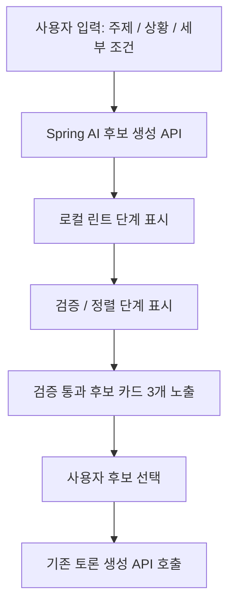

# Spring AI 기능 설계

## 목표

ARENA의 AI 기능은 사용자의 선택 고민을 토론 가능한 구조로 바꾸고, 두 페르소나가 서로 다른 관점에서 논리를 전개하도록 돕는다.

## Provider

## 2026-06-24 현재 구현 상태

- `/new`에서 생성된 후보의 `debateAxis`, `sideAFrame`, `sideBFrame`은 `POST /api/debates` 요청에 포함된다.
- 서버는 후보의 `sideALabel`, `sideBLabel`, `debateAxis`, `sideAFrame`, `sideBFrame`을 `debate_sessions`에 저장한다.
- `POST /api/debates/{debateId}/turns`는 저장된 진영 이름과 프레임을 `debate-single-round-fast-generator.txt` 렌더링 변수로 전달한다. 저장값이 없는 기존 세션은 topic 기반 fallback을 사용한다.
- 사용자가 결과 선택 단계에서 고른 `selectedSide`, `selectedRoundNo`는 `POST /api/debates/{debateId}/stop` body로 전달되어 `debate_sessions`에 저장된다.
- 결과 페이지는 서버의 `selectedSide`, `selectedRoundNo`, `sideALabel`, `sideBLabel`을 우선 사용하고, URL query/localStorage는 이전 데이터 호환용 fallback으로만 사용한다.

- 기본 Provider: GMS OpenAI-compatible API
- Spring 연동: Spring AI `ChatClient`
- 모델: 환경 변수 `GMS_MODEL`로 지정, 기본값 `gpt-5.4-mini`

## Spring AI 베이스 책임 분리

현재 베이스 브랜치는 팀원이 서로 다른 AI 파이프라인을 실험할 수 있도록 Spring AI 호출 환경과 최소 계약만 유지한다. 주제 후보 생성, 검증, 로컬 린트, fallback 같은 품질 파이프라인은 베이스에 고정하지 않고 별도 실험 브랜치에서 비교한다.

| 구성 요소 | 책임 |
| --- | --- |
| `AiClient` | `DebateService`가 의존하는 AI 기능 인터페이스 |
| `AiPipelineService` | 발화/요약 생성 흐름 조합, 발화자 선택, provider 호출과 파싱 연결 |
| `SpringAiClient` | Spring AI `ChatClient`를 통한 실제 provider 호출 |
| `AiPromptFactory` | 발화 생성/요약 생성 system/user prompt 구성 |
| `AiResponseParser` | AI JSON 응답을 DTO로 파싱하고 실패 시 `502 Bad Gateway` 변환 |

선택형 주제 후보 파이프라인은 `ai-experiment-choice-pipeline` 브랜치에 보존한다. 다른 팀원은 동일 베이스에서 새 브랜치를 만들어 다른 파이프라인 구조를 구현하고 비교할 수 있다.

## 선택형 후보 파이프라인 UI

현재 `/new` 화면은 `POST /api/ai/round-candidates`를 호출해 Spring AI가 생성한 세부 라운드 후보를 보여준다.

후보 생성 화면은 API 요청 시작 시 로딩을 표시하고, 응답 도착 즉시 후보 목록을 렌더링한다. 고정 5초 지연은 제거됐다.



Spring AI 후보 생성 화면의 목적은 두 가지다.

- 데모에서 사용자가 ARENA의 핵심 경험을 이해할 수 있게 한다.
- 실제 후보 생성 API가 확정되기 전에도 프론트 사용자 흐름과 서버 토론 생성 계약을 유지한다.

실제 서버 파이프라인으로 전환할 때는 후보 생성, 검증기, 로컬 린트, fallback을 별도 API 또는 AI 서비스 계층으로 연결한다. 이때도 최종적으로 선택된 후보 제목이 토론 세션의 `topic`이 되는 흐름은 유지한다.

## AI 발화 생성

현재 새 토론 자동 진행은 `POST /api/debates/{debateId}/turns/batch`를 사용한다. 이 API는 긴 동기 응답이 아니라 생성 작업 시작/상태 확인 API다. 서버는 선택된 세부주제 `topic`, `roundTitle`, `debateAxis`, `sideAFrame`, `sideBFrame`, `basicConditions`를 `debate-single-round-fast-generator.txt`에 넣고, 백그라운드 executor에서 GMS `gpt-5.4-mini`를 한 번 호출해 10턴을 생성한다.

발화 생성 결과는 두 곳에 저장한다.

- `debate_messages`: 사용자에게 보여줄 실제 발화
- `ai_debate_turn_logs`: 렌더링된 프롬프트, raw provider 응답, 파싱 결과, 성공 상태, latency

새 토론방 자동 진행은 1턴 반복 호출이 아니라 배치 생성 API를 사용한다. 기존 `/turns` 단일 턴 API는 호환용으로 남아 있지만, 기본 프론트 흐름에서는 사용하지 않는다. 배치 생성 작업은 서버에서 계속 실행되므로 사용자가 토론방을 떠나도 저장이 이어지고, 재진입 시 프론트는 저장된 메시지를 다시 조회한다.

### 입력

| 필드 | 설명 |
| --- | --- |
| `topic` | 토론 주제 |
| `mode` | 서버 호환을 위한 토론 모드. 현재 프론트 화면에서는 노출하지 않고 기본값을 내부 전송 |
| `roundNo` | 현재 라운드 번호. 새 토론 배치 생성에서는 선택한 세부주제 1개가 1라운드이므로 `1` |
| `previousMessages` | 이전 발화 목록 |

### 출력

```json
{
  "content": "다음 발화 내용",
  "peakReached": false
}
```

### 페르소나 규칙

| Speaker | 역할 |
| --- | --- |
| COOL_HEADED | 근거, 비용, 리스크, 실용성을 중심으로 발화 |
| PASSIONATE | 만족감, 몰입감, 재미, 경험 가치를 중심으로 발화 |

배치 응답의 `turnIndex`에 따라 두 발화자가 번갈아 등장한다. DB의 `roundNo`는 발화 순번이 아니라 세부주제 라운드 번호다.

### 2026-06-24 토론 배치 생성 흐름

새 토론 시작 흐름은 `POST /api/debates/{debateId}/turns/batch`를 사용한다. 이 API는 `debate-single-round-fast-generator.txt` 기반 생성 작업을 백그라운드에 등록하고 즉시 `GENERATING` 또는 `COMPLETE` 상태를 반환한다. 실제 AI provider 호출과 DB 저장은 서버 작업으로 계속 진행된다. 기존 `/turns` 단일 턴 API는 호환용으로 유지하지만, 새 토론방 자동 진행은 반복 호출하지 않는다.

`turns` 응답은 서버 파서에서 정확히 10개인지, A/B가 각 5개인지, 홀수 턴 A/짝수 턴 B 순서인지 검증한다. 기존 ACTIVE 토론에 10개 미만 메시지만 저장되어 있으면 기존 메시지는 보존하고 부족한 발화만 배치 응답에서 채운다. 처음 선택한 세부주제에서 나온 10개 발화는 모두 `debate_messages.round_no = 1`로 저장하며, 화면 순서는 `messageId` 기준으로 유지한다.

GMS 모델 응답은 간헐적으로 JSON 계약에서 벗어날 수 있으므로, 초기 배치 생성은 provider 호출 또는 `turns` 파싱이 실패하면 같은 프롬프트로 최대 3회까지 재시도한다. 3회 모두 실패했을 때만 `502 Bad Gateway`를 반환한다.

프론트 동작은 다음과 같다.

1. `/debates/{id}?starting=1` 진입 후 현재 세부주제 라운드 메시지가 10개 미만이면 배치 생성 API를 호출한다.
2. API가 `GENERATING`을 반환하면 준비중 화면을 유지하고 `GET /api/debates/{id}`를 polling한다.
3. detail 응답에서 현재 라운드 메시지 10개가 확인되면 준비중 화면을 끄고, 저장된 10개 메시지를 2초 `입력중...` 표시와 함께 순차적으로 보여준다.
4. 10개 메시지를 모두 보여준 뒤 사용자가 어느 쪽 의견에 마음이 가는지 선택한다.
5. 선택 시 `selectedRoundNo`는 현재 세부주제 라운드인 `1`로 저장한다. 요약 생성 API가 늦어도 결과 페이지 이동은 선택 전환 시간 이후 진행한다.

## AI 요약 생성

토론 종료 시 게시글 공유에 필요한 요약 데이터를 생성한다.

```json
{
  "coreArguments": "핵심 주장",
  "highlight": "가장 인상적인 대립점",
  "decisionCriteria": "판단 기준",
  "remainingIssue": "남은 쟁점",
  "summaryText": "게시글 공유용 요약"
}
```

## 예외 처리

- AI 응답이 JSON으로 파싱되지 않으면 `502 Bad Gateway`로 처리한다. 단, 새 토론의 10턴 배치 생성은 간헐적 provider 응답 흔들림을 흡수하기 위해 최대 3회 재시도한다.
- API 키가 없거나 Provider 호출에 실패하면 사용자에게 재시도 안내 메시지를 반환한다.
- 프롬프트는 서버에서 관리해 클라이언트가 AI 시스템 지시문을 직접 조작하지 못하게 한다.

## 향후 개선

- 선택형 후보 생성 API 연결
- 후보 검증기, 로컬 린트, fallback 서버화
- AI 응답 스트리밍
- 사용자 선호도 기반 페르소나 조정
- 토론 품질 점수화
- 요약 결과의 금칙어/정책 필터링

## Spring AI 세부 라운드 후보 생성

`/new` 화면의 기존 로컬 후보 생성 목업은 `POST /api/ai/round-candidates` API로 교체한다. 사용자는 원본 주제만 입력하고, 서버는 Spring AI를 통해 다음 순서로 후보를 생성한다.

1. `topic-frame-generator.txt`: 원본 주제를 큰 토론 주제, A/B 진영, 기본 조건으로 구조화한다.
2. `topic-round-candidates-generator.txt`: 구조화된 주제에서 세부 라운드 후보를 생성한다.
3. `topic-round-candidates-validator.txt`: 후보를 검증하고 최종 후보 5개를 반환한다.

2026-06-25 기준 후보 생성/검증 프롬프트는 사용자가 다시 제공한 버전으로 교체했다. 이 버전은 후보 카드 `title`을 `A vs B` 형태가 아니라 하나의 중립적인 세부주제 이름으로 만들도록 강제한다. A/B의 대립 방향은 `sideAFrame`, `sideBFrame`에만 담는다. generator 프롬프트에는 현재 DTO 계약에 맞춰 `roundId` 출력 요구를 추가했다.

프론트엔드는 반환된 후보의 `title`과 `coreQuestion`을 카드에 보여준다. 사용자가 후보를 선택하면 기존 `POST /api/debates`를 그대로 호출하며, `originalTopic`에는 원본 입력을 저장하고 `topic`에는 선택 후보의 `coreQuestion`을 저장한다.

토론 생성 요청에는 `topicFrame.sideA`와 `topicFrame.sideB`를 각각 `sideALabel`, `sideBLabel`로 함께 전달한다. 서버는 이를 `debate_sessions.side_a_label`, `debate_sessions.side_b_label`에 저장하고, 토론방 표시 이름과 대화 생성 프롬프트의 A/B 진영 이름으로 우선 사용한다. 값이 없는 기존 세션은 프론트의 기존 topic 기반 추론을 fallback으로 사용한다.

데이터 보존을 위해 서버는 `ai_round_candidate_runs`와 `ai_prompt_call_logs`에 후보 생성 run, 렌더링된 프롬프트, raw provider 응답, 파싱 결과, 최종 응답, 실패 정보를 저장한다. 비밀값인 API key, bearer token, request header, 환경 변수 값은 저장하지 않는다.
