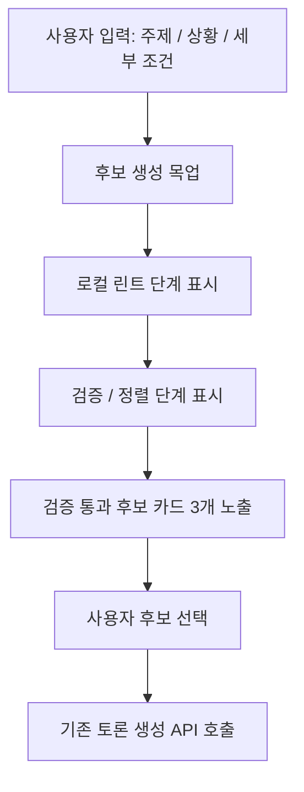

# Spring AI 기능 설계

## 목표

ARENA의 AI 기능은 사용자의 선택 고민을 토론 가능한 구조로 바꾸고, 두 페르소나가 서로 다른 관점에서 논리를 전개하도록 돕는다.

## Provider

- 기본 Provider: OpenAI API
- Spring 연동: Spring AI `ChatClient`
- 모델: 환경 변수 `OPENAI_MODEL`로 지정, 기본값 `gpt-4o-mini`

## Spring AI 베이스 책임 분리

현재 베이스 브랜치는 팀원이 서로 다른 AI 파이프라인을 실험할 수 있도록 Spring AI 호출 환경과 최소 계약만 유지한다. 주제 후보 생성, 검증, 로컬 린트, fallback 같은 품질 파이프라인은 베이스에 고정하지 않고 별도 실험 브랜치에서 비교한다.

| 구성 요소 | 책임 |
| --- | --- |
| `AiClient` | `DebateService`가 의존하는 AI 기능 인터페이스 |
| `AiPipelineService` | 발화/요약 생성 흐름 조합, 발화자 선택, provider 호출과 파싱 연결 |
| `SpringAiClient` | Spring AI `ChatClient`를 통한 실제 provider 호출 |
| `AiPromptFactory` | 발화 생성/요약 생성 system/user prompt 구성 |
| `AiResponseParser` | AI JSON 응답을 DTO로 파싱하고 실패 시 `502 Bad Gateway` 변환 |

선택형 주제 후보 파이프라인은 `ai-experiment-choice-pipeline` 브랜치에 보존한다. 다른 팀원은 동일 베이스에서 새 브랜치를 만들어 다른 파이프라인 구조를 구현하고 비교할 수 있다.

## 선택형 후보 파이프라인 UI

현재 `/new` 화면은 실제 AI 후보 생성 API를 호출하지 않고, 팀 공유 파이프라인 문서의 사용자 흐름을 데모용 목업으로 보여준다.



목업 화면이 보여주는 목적은 두 가지다.

- 데모에서 사용자가 ARENA의 핵심 경험을 이해할 수 있게 한다.
- 실제 후보 생성 API가 확정되기 전에도 프론트 사용자 흐름과 서버 토론 생성 계약을 유지한다.

실제 서버 파이프라인으로 전환할 때는 후보 생성, 검증기, 로컬 린트, fallback을 별도 API 또는 AI 서비스 계층으로 연결한다. 이때도 최종적으로 선택된 후보 제목이 토론 세션의 `topic`이 되는 흐름은 유지한다.

## AI 발화 생성

### 입력

| 필드 | 설명 |
| --- | --- |
| `topic` | 토론 주제 |
| `mode` | 서버 호환을 위한 토론 모드. 현재 프론트 화면에서는 노출하지 않고 기본값을 내부 전송 |
| `roundNo` | 현재 라운드 번호 |
| `previousMessages` | 이전 발화 목록 |

### 출력

```json
{
  "content": "다음 발화 내용",
  "peakReached": false
}
```

### 페르소나 규칙

| Speaker | 역할 |
| --- | --- |
| COOL_HEADED | 근거, 비용, 리스크, 실용성을 중심으로 발화 |
| PASSIONATE | 만족감, 몰입감, 재미, 경험 가치를 중심으로 발화 |

라운드 번호에 따라 두 발화자가 번갈아 등장한다.

## AI 요약 생성

토론 종료 시 게시글 공유에 필요한 요약 데이터를 생성한다.

```json
{
  "coreArguments": "핵심 주장",
  "highlight": "가장 인상적인 대립점",
  "decisionCriteria": "판단 기준",
  "remainingIssue": "남은 쟁점",
  "summaryText": "게시글 공유용 요약"
}
```

## 예외 처리

- AI 응답이 JSON으로 파싱되지 않으면 `502 Bad Gateway`로 처리한다.
- API 키가 없거나 Provider 호출에 실패하면 사용자에게 재시도 안내 메시지를 반환한다.
- 프롬프트는 서버에서 관리해 클라이언트가 AI 시스템 지시문을 직접 조작하지 못하게 한다.

## 향후 개선

- 선택형 후보 생성 API 연결
- 후보 검증기, 로컬 린트, fallback 서버화
- AI 응답 스트리밍
- 사용자 선호도 기반 페르소나 조정
- 토론 품질 점수화
- 요약 결과의 금칙어/정책 필터링
