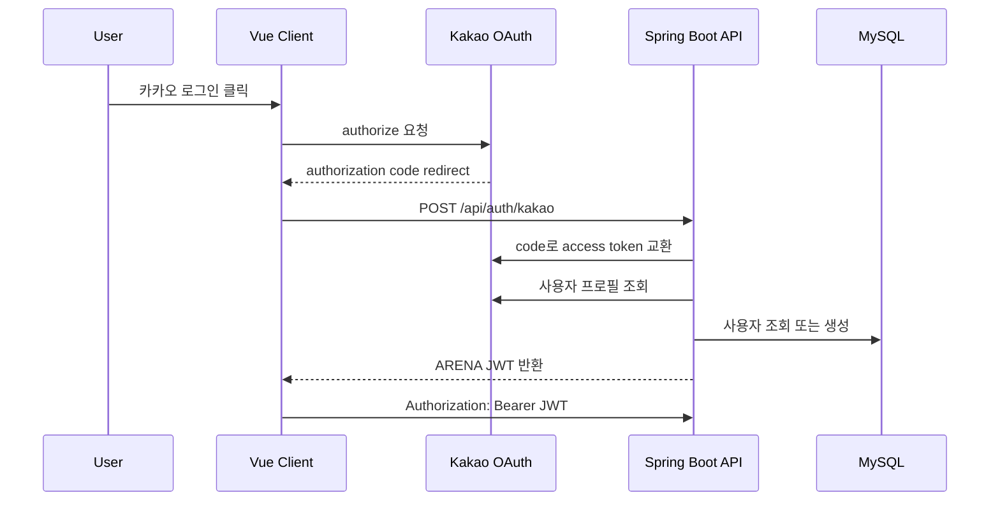

# 인증/인가 및 권한 설계

## 인증 흐름

## 인증 책임 분리

| 구성 요소 | 책임 |
| --- | --- |
| `AuthController` | `/api/auth/**` 요청 검증과 응답 변환 |
| `AuthService` | Kakao 로그인과 서비스 JWT 발급 흐름 조합 |
| `UserService` | 사용자 생성/조회, Kakao 사용자 조회 또는 생성, 닉네임 수정, 권한 변경 |
| `KakaoOAuthClient` | Kakao authorization code 교환과 프로필 조회 |
| `JwtTokenProvider` | 서비스 JWT 생성과 claim 파싱 |
| `JwtAuthenticationFilter` | `Authorization: Bearer` 토큰 검증 후 SecurityContext 설정 |

## JWT 설계

JWT payload에는 다음 정보를 포함한다.

| Claim | 설명 |
| --- | --- |
| `sub` | 서비스 로그인 ID |
| `userId` | 사용자 PK |
| `role` | USER 또는 ADMIN |
| `iat` | 발급 시각 |
| `exp` | 만료 시각 |

클라이언트는 JWT를 `Authorization: Bearer <token>` 형식으로 API 요청에 포함한다.

닉네임은 변경 가능한 프로필 데이터이므로 JWT claim에 의존하지 않는다. 클라이언트는 로그인 직후와 새로고침 시 `GET /api/users/me`를 호출해 최신 사용자 정보를 동기화한다.

## 프로필 관리

| API | 권한 | 설명 |
| --- | --- | --- |
| `GET /api/users/me` | USER | 현재 로그인 사용자 프로필 조회 |
| `PATCH /api/users/me/nickname` | USER | 현재 로그인 사용자 닉네임 수정 |

닉네임 정책:

- 2자 이상 20자 이하
- 한글, 영문, 숫자, 밑줄 허용
- 사용자 간 중복 불가
- 중복 시 `409 Conflict`, 형식 오류 시 `400 Bad Request`

## 인가 정책

| 경로 | 권한 |
| --- | --- |
| `/api/auth/kakao` | Public |
| `GET /api/posts/**` | Public |
| `/api/users/**` | USER |
| `/api/debates/**` | USER |
| `/api/posts/{id}/votes` | USER |
| `/api/posts/{id}/comments` | USER |
| `/api/admin/**` | ADMIN |

## 권한 모델

| Role | 설명 |
| --- | --- |
| USER | 일반 사용자. 토론 생성, AI 발화 요청, 게시글 공유, 투표/댓글 작성 가능 |
| ADMIN | 관리자. USER 권한에 더해 사용자/게시글 관리 가능 |

## 보안 고려사항

- Kakao access token은 백엔드에서만 사용하고 클라이언트에 저장하지 않는다.
- 서비스 API 인증은 Kakao token이 아니라 자체 JWT로 처리한다.
- JWT secret은 최소 32자 이상의 환경 변수로 관리한다.
- CORS는 로컬 개발 도메인과 필요한 헤더만 허용한다.
- 클라이언트 시크릿이 켜져 있으면 Kakao token 교환 시 `client_secret`을 함께 전달한다.
