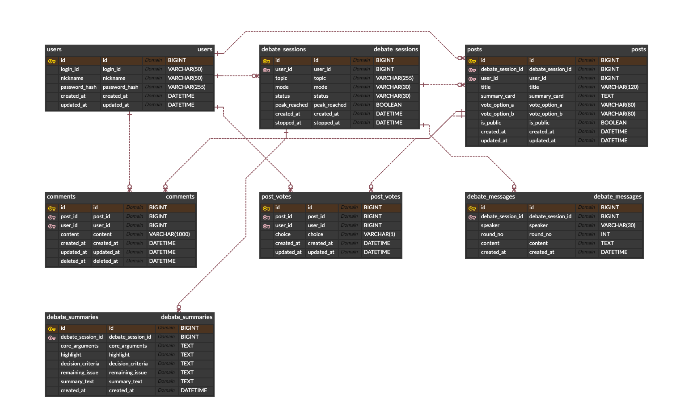

# ARENA(아레나) ERD 및 계층 구조 설명

## 1. ERD

GitLab Mermaid 렌더링 환경에 의존하지 않도록 이미지 산출물로 제공한다.



## 2. 테이블 관계

| 관계 | 설명 |
| --- | --- |
| users 1:N debate_sessions | 한 사용자는 여러 토론을 생성할 수 있다. |
| debate_sessions 1:N debate_messages | 한 토론은 여러 AI 발화 로그를 가진다. |
| debate_sessions 1:1 debate_summaries | 중단된 토론은 하나의 요약을 가진다. |
| debate_sessions 1:N posts | 공유된 토론은 라운드 단위로 여러 게시글이 될 수 있다. |
| users 1:N posts | 한 사용자는 여러 게시글을 작성할 수 있다. |
| posts 1:N comments | 한 게시글은 여러 댓글을 가진다. |
| users 1:N comments | 한 사용자는 여러 댓글을 작성할 수 있다. |
| posts 1:N post_votes | 한 게시글은 여러 사용자 투표를 가진다. |
| users 1:N post_votes | 한 사용자는 여러 게시글에 투표할 수 있다. |

## 3. 테이블 정의

### users

| 컬럼 | 타입 | 제약 | 설명 |
| --- | --- | --- | --- |
| id | BIGINT | PK, AUTO_INCREMENT | 회원 ID |
| login_id | VARCHAR(50) | NOT NULL, UNIQUE | 로그인 ID |
| nickname | VARCHAR(50) | NOT NULL, UNIQUE | 표시 닉네임 |
| password_hash | VARCHAR(255) | NULL | 로컬 로그인 확장용 비밀번호 해시. 카카오 사용자는 NULL |
| provider | VARCHAR(20) | NOT NULL DEFAULT LOCAL | 인증 제공자. 현재 KAKAO 사용 |
| provider_id | VARCHAR(100) | NULL | Kakao 사용자 고유 ID |
| role | VARCHAR(20) | NOT NULL DEFAULT USER | USER 또는 ADMIN |
| created_at | DATETIME | NOT NULL | 생성일 |
| updated_at | DATETIME | NOT NULL | 수정일 |

### debate_sessions

| 컬럼 | 타입 | 제약 | 설명 |
| --- | --- | --- | --- |
| id | BIGINT | PK, AUTO_INCREMENT | 토론 세션 ID |
| user_id | BIGINT | FK users.id, NOT NULL | 생성자 |
| topic | VARCHAR(255) | NOT NULL | 토론 주제 |
| original_topic | VARCHAR(255) | NOT NULL | 사용자가 입력한 원본 주제 |
| side_a_label | VARCHAR(120) | NULL | 후보 생성에서 만든 A 진영 이름 |
| side_b_label | VARCHAR(120) | NULL | 후보 생성에서 만든 B 진영 이름 |
| debate_axis | VARCHAR(255) | NULL | 선택 후보의 토론 축 |
| side_a_frame | VARCHAR(1000) | NULL | A 진영 논증 프레임 |
| side_b_frame | VARCHAR(1000) | NULL | B 진영 논증 프레임 |
| mode | VARCHAR(30) | NOT NULL | PRACTICAL, ENTERTAINMENT |
| status | VARCHAR(30) | NOT NULL | ACTIVE, STOPPED, SHARED |
| peak_reached | BOOLEAN | NOT NULL DEFAULT FALSE | 논쟁 정점 감지 여부 |
| selected_side | VARCHAR(30) | NULL | 결과 페이지에서 사용자가 고른 진영 |
| selected_round_no | INT | NULL | 결과 페이지에서 우선 표시할 라운드 |
| created_at | DATETIME | NOT NULL | 생성일 |
| stopped_at | DATETIME | NULL | 중단일 |

### debate_messages

| 컬럼 | 타입 | 제약 | 설명 |
| --- | --- | --- | --- |
| id | BIGINT | PK, AUTO_INCREMENT | 메시지 ID |
| debate_session_id | BIGINT | FK debate_sessions.id, NOT NULL | 토론 세션 |
| speaker | VARCHAR(30) | NOT NULL | COOL_HEADED, PASSIONATE, SYSTEM |
| round_no | INT | NOT NULL | 라운드 번호 |
| content | TEXT | NOT NULL | 발화 내용 |
| created_at | DATETIME | NOT NULL | 생성일 |

### debate_summaries

| 컬럼 | 타입 | 제약 | 설명 |
| --- | --- | --- | --- |
| id | BIGINT | PK, AUTO_INCREMENT | 요약 ID |
| debate_session_id | BIGINT | FK debate_sessions.id, UNIQUE, NOT NULL | 토론 세션 |
| core_arguments | TEXT | NOT NULL | 핵심 주장 |
| highlight | TEXT | NULL | 하이라이트 |
| decision_criteria | TEXT | NULL | 선택 기준 |
| remaining_issue | TEXT | NULL | 남은 쟁점 |
| summary_text | TEXT | NOT NULL | 요약 본문 |
| created_at | DATETIME | NOT NULL | 생성일 |

### posts

| 컬럼 | 타입 | 제약 | 설명 |
| --- | --- | --- | --- |
| id | BIGINT | PK, AUTO_INCREMENT | 게시글 ID |
| debate_session_id | BIGINT | FK debate_sessions.id, NOT NULL | 공유된 토론 라운드 세션 |
| user_id | BIGINT | FK users.id, NOT NULL | 작성자 |
| share_round_no | INT | NOT NULL DEFAULT 1 | 결과 페이지에서 공유한 라운드 번호 |
| title | VARCHAR(120) | NOT NULL | 게시글 제목 |
| summary_card | TEXT | NOT NULL | 목록용 요약 |
| share_body | TEXT | NULL | 세부주제 제목, 상세설명, 사용자가 공유 모달에서 작성한 본문 |
| vote_option_a | VARCHAR(80) | NOT NULL | 투표 선택지 A |
| vote_option_b | VARCHAR(80) | NOT NULL | 투표 선택지 B |
| is_public | BOOLEAN | NOT NULL DEFAULT TRUE | 공개 여부 |
| created_at | DATETIME | NOT NULL | 생성일 |
| updated_at | DATETIME | NOT NULL | 수정일 |

### comments

| 컬럼 | 타입 | 제약 | 설명 |
| --- | --- | --- | --- |
| id | BIGINT | PK, AUTO_INCREMENT | 댓글 ID |
| post_id | BIGINT | FK posts.id, NOT NULL | 게시글 |
| user_id | BIGINT | FK users.id, NOT NULL | 작성자 |
| content | VARCHAR(1000) | NOT NULL | 댓글 내용 |
| created_at | DATETIME | NOT NULL | 생성일 |
| updated_at | DATETIME | NOT NULL | 수정일 |
| deleted_at | DATETIME | NULL | 소프트 삭제일 |

### post_votes

| 컬럼 | 타입 | 제약 | 설명 |
| --- | --- | --- | --- |
| id | BIGINT | PK, AUTO_INCREMENT | 투표 ID |
| post_id | BIGINT | FK posts.id, NOT NULL | 게시글 |
| user_id | BIGINT | FK users.id, NOT NULL | 투표자 |
| choice | VARCHAR(1) | NOT NULL | A 또는 B |
| created_at | DATETIME | NOT NULL | 생성일 |
| updated_at | DATETIME | NOT NULL | 수정일 |
| post_id, user_id | UNIQUE | NOT NULL | 한 사용자당 게시글 1투표 제한 |

## 4. 계층 구조

```text
Browser
  -> Controller
      -> Service
          -> Mapper Interface
              -> MyBatis XML
                  -> MySQL
          -> Spring AI 연동 계층
              -> GMS OpenAI-compatible API
```

### Controller 계층

HTTP 요청과 응답 DTO를 담당한다. 인증 사용자는 Spring Security Principal에서 읽고, 세부 비즈니스 판단은 Service로 넘긴다.

### Service 계층

도메인 규칙을 담당한다. 예를 들어 본인 토론 여부, ACTIVE/STOPPED/SHARED 상태 전이, 게시글 공유 가능 여부, 댓글 삭제 권한을 검사한다.

### Mapper 계층

MyBatis mapper interface와 XML SQL로 DB 접근을 담당한다. SQL은 `src/main/resources/mapper/*.xml`에 둔다.

### AI Client 계층

Spring AI를 통해 GMS OpenAI-compatible API 호출을 담당한다. 현재 `dev` 기준은 `gpt-5.4-mini` 기반 주제 후보 생성과 10턴 배치 토론 생성을 사용한다. AI 생성 계층은 DB에 직접 접근하지 않고, Service 계층이 생성 결과와 prompt log를 저장한다.

## 5. 주요 인덱스

| 테이블 | 인덱스 | 목적 |
| --- | --- | --- |
| users | UNIQUE(login_id) | 서비스 내부 로그인 ID 중복 방지. 카카오 사용자는 `kakao_{providerId}` 사용 |
| users | UNIQUE(nickname) | 닉네임 중복 방지 |
| users | UNIQUE(provider, provider_id) | 외부 인증 제공자 계정 중복 가입 방지 |
| debate_sessions | INDEX(user_id, created_at) | 내 토론 목록 조회 |
| debate_messages | INDEX(debate_session_id, round_no, id) | 토론 로그 정렬 조회 |
| posts | INDEX(debate_session_id) | 토론별 공유 게시글 조회 |
| posts | INDEX(is_public, created_at) | 공개 게시글 최신순 조회 |
| comments | INDEX(post_id, created_at) | 게시글 댓글 조회 |
| post_votes | UNIQUE(post_id, user_id) | 중복 투표 방지 및 투표 변경 |
| post_votes | INDEX(post_id, choice) | 선택지별 투표 수 집계 |

## 6. 상태값

| 컬럼 | 값 | 설명 |
| --- | --- | --- |
| debate_sessions.mode | PRACTICAL | 현재 프론트 기본 전송값. 서버/DB 호환을 위한 내부 모드 |
| debate_sessions.mode | ENTERTAINMENT | 기존 데이터와 확장 가능성을 위한 내부 모드 |
| debate_sessions.status | ACTIVE | 진행 중 |
| debate_sessions.status | STOPPED | 중단 및 요약 완료 |
| debate_sessions.status | SHARED | 게시판 공유 완료 |
| debate_messages.speaker | COOL_HEADED | 주제의 앞쪽 선택지 진영 |
| debate_messages.speaker | PASSIONATE | 주제의 뒤쪽 선택지 진영 |
| debate_messages.speaker | SYSTEM | 시스템 메시지 |
| post_votes.choice | A | 게시글 투표 선택지 A |
| post_votes.choice | B | 게시글 투표 선택지 B |
