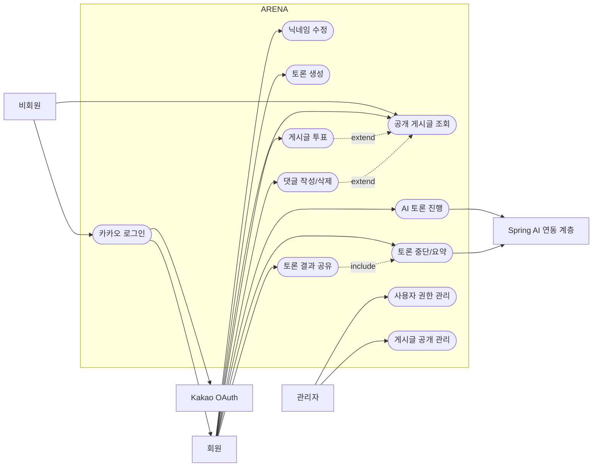

# ARENA(아레나) 유스케이스

## 액터

| 액터 | 설명 |
| --- | --- |
| 비회원 | 공개 게시판과 게시글을 읽고, 카카오 로그인 화면에 접근할 수 있는 방문자 |
| 회원 | 카카오 로그인 후 토론 생성, 토론 중단, 게시판 공유, 투표, 댓글 작성이 가능한 사용자 |
| 관리자 | 사용자 권한과 게시글 공개 여부를 관리할 수 있는 ADMIN 권한 사용자 |
| Kakao OAuth | 사용자 인증과 프로필 조회를 제공하는 외부 인증 제공자 |
| AI 연동 계층 | Spring AI를 통해 토론 발화와 요약을 생성하는 서버 내부 계층 |
| 시스템 | 인증/인가, 데이터 저장, 화면/API 응답을 담당하는 Spring Boot 애플리케이션 |

## 유스케이스 다이어그램

이미지 및 원본 산출물:

- 간단 PlantUML 원본: `diagrams/arena-use-case-simple.puml`
- 간단 Mermaid 원본: `diagrams/arena-use-case-simple.mmd`
- 깔끔한 PNG 이미지: `diagrams/clean/arena-use-case-clean-ko.png`
- 한글 SVG 이미지: `diagrams/arena-use-case-ko.svg`
- 한글 PNG 이미지: `diagrams/arena-use-case-ko.png`

> 참고: 현재 구현 기준의 최신 관계는 아래 Mermaid 원본과 `diagrams/arena-use-case-ko.svg`를 기준으로 한다. 일부 보조 PNG는 발표용 정적 산출물로 함께 보관한다.

## 유스케이스 목록

| ID | 유스케이스 | 주 액터 | 트리거 | 사전 조건 | 성공 결과 |
| --- | --- | --- | --- | --- | --- |
| UC-01 | 카카오 로그인 | 비회원 | 카카오 로그인 클릭 | Kakao 앱 설정과 redirect URI가 등록됨 | 서비스 JWT 발급 |
| UC-02 | 로그아웃 | 회원 | 로그아웃 클릭 | 로그인 상태 | 클라이언트 JWT 삭제 |
| UC-03 | 게시판 목록 조회 | 비회원 | 게시판 페이지 접근 | 공개 게시글 또는 빈 상태 존재 | 요약 카드 목록 표시 |
| UC-04 | 게시글 상세 조회 | 비회원 | 게시글 접근 | 공개 게시글 존재 | 요약, 전체 토론 로그, 댓글 표시 |
| UC-05 | 토론 생성 | 회원 | 후보 선택 후 토론 시작 | 로그인 상태 | ACTIVE 토론 세션 생성 |
| UC-06 | 다음 토론 턴 생성 | 회원 | 한 라운드 더 요청 | 본인 ACTIVE 토론 | AI 발화 생성 및 저장 |
| UC-07 | 토론 중단 | 회원 | 토론 멈추기 클릭 | 본인 ACTIVE 토론 | STOPPED 상태 전환 및 요약 생성 |
| UC-08 | 중단된 토론 공유 | 회원 | 게시판 공유 클릭 | 본인 STOPPED 토론 | 공개 게시글 생성 |
| UC-09 | 댓글 작성 | 회원 | 댓글 제출 | 로그인 상태이고 게시글 존재 | 댓글 저장 및 표시 |
| UC-10 | 본인 댓글 삭제 | 회원 | 본인 댓글 삭제 클릭 | 댓글 작성자 본인 | 댓글 소프트 삭제 |
| UC-11 | 본인 게시글 삭제 | 회원 | 본인 게시글 삭제 클릭 | 게시글 작성자 본인 | 게시글 삭제 또는 비공개 처리 |
| UC-12 | 게시글 검색 | 비회원 | 검색어 입력 | 공개 게시글 존재 | 제목, 요약 카드, 토론 주제 기준 검색 결과 표시 |
| UC-13 | 게시글 필터/정렬 | 비회원 | 필터 또는 정렬 선택 | 공개 게시글 존재 | 모드 필터, 최신순, 댓글순, 투표순 목록 표시 |
| UC-14 | 게시글 투표 | 회원 | 선택지 A/B 투표 | 로그인 상태이고 게시글 존재 | 투표 저장 및 비율 갱신 |
| UC-15 | 기존 투표 변경 | 회원 | 다른 선택지 재투표 | 같은 게시글에 기존 투표 존재 | 기존 선택지가 변경되고 비율 갱신 |
| UC-16 | AI 요약 생성 | 시스템 | 토론 중단 요청 성공 | 토론 메시지 존재 | AI 요약 결과 저장 |
| UC-17 | AI 장애 처리 | 시스템 | AI 서버 타임아웃 또는 오류 | AI 기능 요청 발생 | 명확한 생성 실패 응답 반환 |
| UC-18 | 사용자 권한 변경 | 관리자 | 권한 변경 요청 | ADMIN 권한 | 대상 사용자 role 변경 |
| UC-19 | 게시글 공개 여부 변경 | 관리자 | 공개 여부 변경 요청 | ADMIN 권한 | 게시글 isPublic 변경 |
| UC-20 | 닉네임 수정 | 회원 | 프로필 닉네임 저장 | 로그인 상태, 중복 없는 닉네임 | 현재 사용자 nickname 변경 |

## 주요 시나리오: 카카오 로그인, 토론 생성, 중단, 공유

1. 비회원이 카카오 로그인 버튼을 클릭한다.
2. Kakao OAuth가 authorization code를 프론트 콜백 URL로 전달한다.
3. 프론트가 code와 redirectUri를 `/api/auth/kakao`로 전달한다.
4. 시스템이 Kakao 프로필을 조회하고 사용자 정보를 조회 또는 생성한다.
5. 시스템이 서비스 JWT를 발급한다.
6. 회원이 토론 주제, 상황/조건, 세부 조건을 입력한다.
7. 화면이 후보 생성, 로컬 린트, 검증/정렬 흐름을 표시한다.
8. 회원이 검증 통과 후보 중 하나를 선택한다.
9. 시스템이 선택된 후보 제목으로 ACTIVE 토론 세션을 생성한다.
10. 회원이 다음 토론 턴을 요청한다.
11. 시스템이 현재 문맥을 Spring AI 연동 계층에 전달한다.
12. AI 연동 계층이 페르소나 발화를 반환한다.
13. 시스템이 발화를 저장한다.
14. 회원이 추가 라운드를 진행하거나 토론을 멈춘다.
15. 시스템이 요약을 저장하고 토론을 STOPPED 상태로 변경한다.
16. 회원이 투표 선택지 A/B를 입력해 중단된 토론을 공유한다.
17. 시스템이 공개 게시글을 생성한다.
18. 비회원 또는 회원이 게시글 목록에서 검색, 필터, 정렬을 사용한다.
19. 회원이 게시글 상세에서 A/B 선택지에 투표한다.
20. 시스템이 선택지별 투표 수와 비율을 갱신한다.

## 대안 및 예외 흐름

| 케이스 | 조건 | 시스템 응답 |
| --- | --- | --- |
| A-01 | 카카오 인가 코드가 유효하지 않음 | 로그인 실패 메시지와 인증 오류 반환 |
| A-02 | 비회원이 토론 생성을 시도 | 로그인 화면 이동 또는 인증 오류 반환 |
| A-03 | 주제가 길이 제한 초과 | 검증 메시지와 함께 요청 거부 |
| A-03-1 | 닉네임이 중복됨 | 409 Conflict와 중복 안내 메시지 반환 |
| A-03-2 | 닉네임 형식이 잘못됨 | 400 Bad Request와 입력값 확인 메시지 반환 |
| A-04 | 토론 최대 라운드 도달 | 다음 턴 생성을 막고 토론 중단 안내 |
| A-05 | 다음 턴 생성 중 AI 서버 실패 | 정상 메시지로 저장하지 않고 재시도 가능한 오류 반환 |
| A-06 | 요약 생성 실패 | 실패 응답을 반환하고 재시도 가능 상태 유지 |
| A-07 | 다른 사용자의 댓글 삭제 시도 | 권한 없음 응답 반환 |
| A-08 | 다른 사용자의 토론 공유 시도 | 권한 없음 응답 반환 |
| A-09 | 비회원이 투표 시도 | 로그인 화면 이동 또는 인증 오류 반환 |
| A-10 | 잘못된 투표 선택지 제출 | 검증 메시지와 함께 요청 거부 |
| A-11 | 검색 결과 없음 | 빈 목록과 검색 조건 유지 |
| A-12 | USER가 관리자 API 호출 | 403 Forbidden 반환 |

## 권한 매트릭스

| 기능 | 비회원 | 회원 | 작성자 | 관리자 |
| --- | --- | --- | --- | --- |
| 게시판 목록 조회 | 가능 | 가능 | 가능 | 가능 |
| 공개 게시글 상세 조회 | 가능 | 가능 | 가능 | 가능 |
| 게시글 검색/필터 | 가능 | 가능 | 가능 | 가능 |
| 카카오 로그인 | 가능 | 불가 | 불가 | 불가 |
| 닉네임 수정 | 불가 | 가능 | 가능 | 가능 |
| 토론 생성 | 불가 | 가능 | 가능 | 가능 |
| 토론 턴 생성 | 불가 | 가능 | 본인 토론만 가능 | 본인 토론만 가능 |
| 토론 중단 | 불가 | 가능 | 본인 토론만 가능 | 본인 토론만 가능 |
| 토론 공유 | 불가 | 가능 | 본인 토론만 가능 | 본인 토론만 가능 |
| 게시글 투표 | 불가 | 가능 | 가능 | 가능 |
| 기존 투표 변경 | 불가 | 가능 | 가능 | 가능 |
| 댓글 작성 | 불가 | 가능 | 가능 | 가능 |
| 댓글 삭제 | 불가 | 불가 | 본인 댓글만 가능 | 정책상 직접 삭제 API 없음 |
| 게시글 삭제 | 불가 | 불가 | 본인 게시글만 가능 | 공개 여부 변경 가능 |
| 사용자 권한 변경 | 불가 | 불가 | 불가 | 가능 |
| 게시글 공개 여부 변경 | 불가 | 불가 | 불가 | 가능 |
