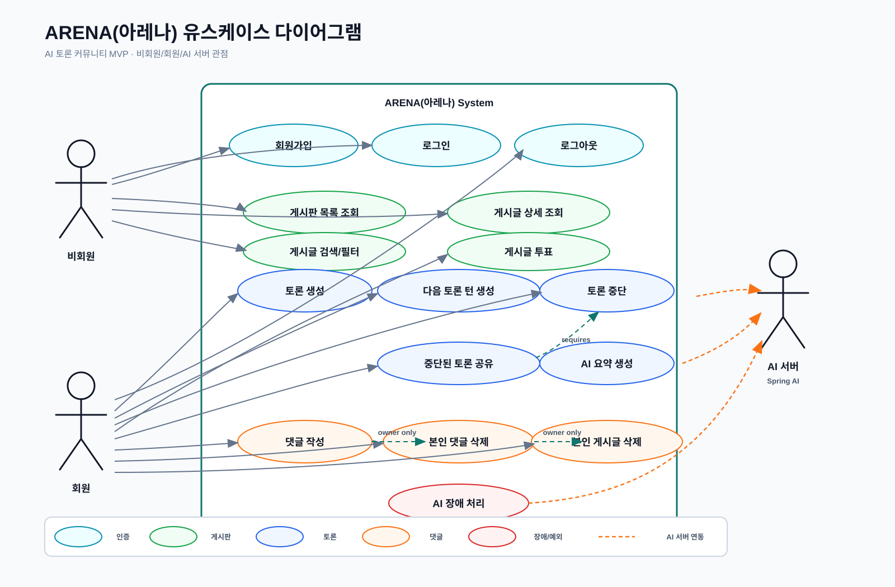

# ARENA(아레나) 유스케이스

## 액터

| 액터 | 설명 |
| --- | --- |
| 비회원 | 공개 게시판과 게시글을 읽고, 회원가입/로그인 화면에 접근할 수 있는 방문자 |
| 회원 | 로그인 후 토론 생성, 토론 중단, 게시판 공유, 투표, 댓글 작성이 가능한 사용자 |
| AI 연동 계층 | Spring AI를 통해 토론 발화와 요약을 생성하는 서버 내부 계층 |
| 시스템 | 인증/인가, 데이터 저장, 화면/API 응답을 담당하는 Spring Boot 애플리케이션 |

## 유스케이스 다이어그램

이미지 및 원본 산출물:

- 간단 PlantUML 원본: `diagrams/arena-use-case-simple.puml`
- 간단 Mermaid 원본: `diagrams/arena-use-case-simple.mmd`
- 깔끔한 PNG 이미지: `diagrams/clean/arena-use-case-clean-ko.png`
- 한글 SVG 이미지: `diagrams/arena-use-case-ko.svg`
- 한글 PNG 이미지: `diagrams/arena-use-case-ko.png`

GitLab의 외부 Mermaid 렌더링에 의존하지 않도록 문서 본문에는 이미지 산출물을 기준으로 연결한다.

## 유스케이스 목록

| ID | 유스케이스 | 주 액터 | 트리거 | 사전 조건 | 성공 결과 |
| --- | --- | --- | --- | --- | --- |
| UC-01 | 회원가입 | 비회원 | 회원가입 폼 제출 | 아이디와 닉네임이 중복되지 않음 | BCrypt 해시 비밀번호로 계정 생성 |
| UC-02 | 로그인 | 비회원 | 로그인 정보 제출 | 계정이 존재함 | JWT 발급 |
| UC-03 | 로그아웃 | 회원 | 로그아웃 클릭 | 로그인 상태 | 클라이언트 JWT 삭제 |
| UC-04 | 게시판 목록 조회 | 비회원 | 게시판 페이지 접근 | 공개 게시글 또는 빈 상태 존재 | 요약 카드 목록 표시 |
| UC-05 | 게시글 상세 조회 | 비회원 | 게시글 접근 | 공개 게시글 존재 | 요약, 전체 토론 로그, 댓글 표시 |
| UC-06 | 토론 생성 | 회원 | 주제와 모드 제출 | 로그인 상태 | ACTIVE 토론 세션 생성 |
| UC-07 | 다음 토론 턴 생성 | 회원 | 한 라운드 더 요청 | ACTIVE 상태이며 최대 라운드 미초과 | AI 발화 생성 및 저장 |
| UC-08 | 토론 중단 | 회원 | 토론 멈추기 클릭 | 본인 ACTIVE 토론 | STOPPED 상태 전환 및 요약 생성 |
| UC-09 | 중단된 토론 공유 | 회원 | 게시판 공유 클릭 | 본인 STOPPED 토론 | 공개 게시글 생성 |
| UC-10 | 댓글 작성 | 회원 | 댓글 제출 | 로그인 상태이고 게시글 존재 | 댓글 저장 및 표시 |
| UC-11 | 본인 댓글 삭제 | 회원 | 본인 댓글 삭제 클릭 | 댓글 작성자 본인 | 댓글 삭제 또는 소프트 삭제 |
| UC-12 | 본인 게시글 삭제 | 회원 | 본인 게시글 삭제 클릭 | 게시글 작성자 본인 | 게시글 삭제 또는 비공개 처리 |
| UC-13 | 게시글 검색 | 비회원 | 검색어 입력 | 공개 게시글 존재 | 제목, 요약 카드, 토론 주제 기준 검색 결과 표시 |
| UC-14 | 게시글 필터/정렬 | 비회원 | 필터 또는 정렬 선택 | 공개 게시글 존재 | 모드 필터, 최신순, 댓글순, 투표순 목록 표시 |
| UC-15 | 게시글 투표 | 회원 | 선택지 A/B 투표 | 로그인 상태이고 게시글 존재 | 투표 저장 및 비율 갱신 |
| UC-16 | 기존 투표 변경 | 회원 | 다른 선택지 재투표 | 같은 게시글에 기존 투표 존재 | 기존 선택지가 변경되고 비율 갱신 |
| UC-17 | AI 요약 생성 | 시스템 | 토론 중단 요청 성공 | 토론 메시지 존재 | AI 서버가 요약 결과 반환 |
| UC-18 | AI 장애 처리 | 시스템 | AI 서버 타임아웃 또는 오류 | AI 기능 요청 발생 | 명확한 생성 실패 응답 반환 |

## 주요 시나리오: 토론 생성, 중단, 공유

1. 회원이 로그인합니다.
2. 회원이 토론 주제를 입력합니다.
3. 회원이 실용 판정 또는 예능 배틀 모드를 선택합니다.
4. 시스템이 ACTIVE 토론 세션을 생성합니다.
5. 회원이 토론방에 진입합니다.
6. 회원이 다음 토론 턴을 요청합니다.
7. 시스템이 현재 문맥을 AI 서버에 전달합니다.
8. AI 서버가 페르소나 발화를 반환합니다.
9. 시스템이 발화를 저장합니다.
10. 회원이 추가 라운드를 진행하거나 토론을 멈춥니다.
11. 시스템이 AI 서버에 요약 생성을 요청합니다.
12. 시스템이 요약을 저장하고 토론을 STOPPED 상태로 변경합니다.
13. 회원이 투표 선택지 A/B를 입력해 중단된 토론을 공유합니다.
14. 시스템이 공개 게시글을 생성합니다.
15. 비회원 또는 회원이 게시글 목록에서 검색, 필터, 정렬을 사용합니다.
16. 회원이 게시글 상세에서 A/B 선택지에 투표합니다.
17. 시스템이 선택지별 투표 수와 비율을 갱신합니다.

## 대안 및 예외 흐름

| 케이스 | 조건 | 시스템 응답 |
| --- | --- | --- |
| A-01 | 비회원이 토론 생성을 시도 | 로그인 화면 이동 또는 인증 오류 반환 |
| A-02 | 주제가 길이 제한 초과 | 검증 메시지와 함께 요청 거부 |
| A-03 | 토론 최대 라운드 도달 | 다음 턴 생성을 막고 토론 중단 안내 |
| A-04 | 다음 턴 생성 중 AI 서버 실패 | 정상 메시지로 저장하지 않고 재시도 가능한 오류 반환 |
| A-05 | 요약 생성 실패 | STOPPED 상태 유지 후 요약 재시도 허용 |
| A-06 | 다른 사용자의 댓글 삭제 시도 | 권한 없음 응답 반환 |
| A-07 | 다른 사용자의 토론 공유 시도 | 권한 없음 응답 반환 |
| A-08 | 비회원이 투표 시도 | 로그인 화면 이동 또는 인증 오류 반환 |
| A-09 | 잘못된 투표 선택지 제출 | 검증 메시지와 함께 요청 거부 |
| A-10 | 검색 결과 없음 | 빈 목록과 검색 조건 유지 |

## 권한 매트릭스

| 기능 | 비회원 | 회원 | 작성자 |
| --- | --- | --- | --- |
| 게시판 목록 조회 | 가능 | 가능 | 가능 |
| 공개 게시글 상세 조회 | 가능 | 가능 | 가능 |
| 게시글 검색/필터 | 가능 | 가능 | 가능 |
| 회원가입 | 가능 | 불가 | 불가 |
| 토론 생성 | 불가 | 가능 | 가능 |
| 토론 턴 생성 | 불가 | 가능 | 본인 토론만 가능 |
| 토론 중단 | 불가 | 가능 | 본인 토론만 가능 |
| 토론 공유 | 불가 | 가능 | 본인 토론만 가능 |
| 게시글 투표 | 불가 | 가능 | 가능 |
| 기존 투표 변경 | 불가 | 가능 | 가능 |
| 댓글 작성 | 불가 | 가능 | 가능 |
| 댓글 삭제 | 불가 | 불가 | 본인 댓글만 가능 |
| 게시글 삭제 | 불가 | 불가 | 본인 게시글만 가능 |
